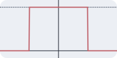
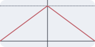
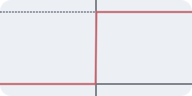
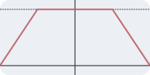
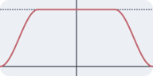

# Simulation

Simulation are described by two sections: script and shape expression(s).

## Script

```rust
struct Hailstone;

impl Hailstone {
  pub fn new(args) { Self }

  pub fn register_bot(bot) {
    bot.register_action(ActionTrigger::alive(100.0), Self::do_nothing);
  }

  pub async fn do_nothing(self) {
    println("doing nothing ...")
  }
}
```

Script is a [rune](https://rune-rs.github.io/) script and it is used to define *models* which represents the behaviour of the bots.
Each model is represented by a struct which needs to define *instance construction* and *model registration* methods.

### Instance Construction

Is a function named `new` which takes one argument, and return the model instance (`Self`).

The function argument passed to the constructor contains the following fields:

 * `bot_id: u32` incremental index for the model/agent.
 * `internal_id: u64` unique index inside the agent.
 * `global_id: u64` unique index for the simulation.

### Model Registration

Is a function named `register_bot` which takes one argument and returns nothing.

The function argument can be used to customize the model behaviour:

 * `registry.set_interval_millis(10000)` by default actions are triggered each 5 seconds, with this method the interval can be modified.
 * `registry.register_action(ActionTrigger::alive(100.0), Self::do_something)` a new action is registered with a weight that is used to determine the probability the action is chosen.
   * The callback function must be async and take `self` as the only parameter.
 * `registry.register_action(ActionTrigger::enter_state(BotState::Running), Self::on_connect)` the given action is bound to a lifetime hook, each time the bot enters in the selected state this action will be called.
   * The callback function must be async and take `self` as the only parameter.
   * Available states are:
     * `Initializing` The bot is instantiated but not yet ready
     * `Running` The bot is ready
     * `Stopping` The bot is terminating
     * `Custom(u32)` Custom states

## Shape expression

For each model defined in the script a shape expression can be defined.

Expressions are evaluated by hailstorm once a second by valorizing t variable with the number of seconds passed from the start of the simulation.
Instances of the model are then created or removed to match the count.

Some custom functions are defined:

<center>

 |     function      |            plot             |
 |:-----------------:|:---------------------------:|
 | `rect(t)`         |  |
 | `tri(t)`          |   |
 | `step(t)`         |  |
 | `trapz(t,B,b)`    |  |
 | `costrapz(t,B,b)` |  |

</center>