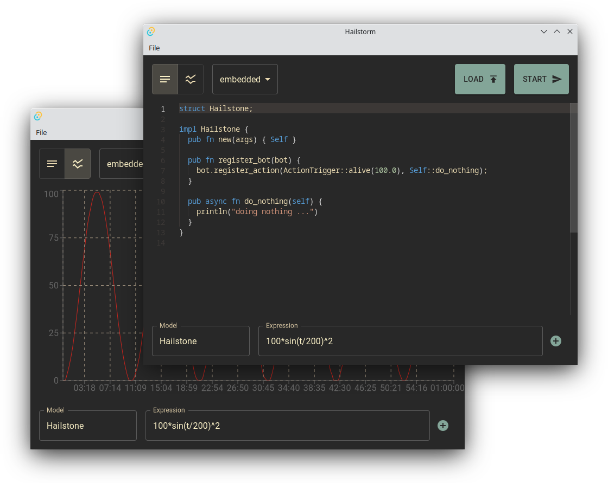

import Bleed from 'nextra-theme-docs/bleed'

# Hailstorm App

<Bleed></Bleed>


Hailstorm app can be used to write simulations and to launch them.

By default it connects to the embedded hailstorm instance, other connections can be defined in the config file.

## File format

Simulations can be loaded/stored in hsp format, that is basically just a yaml with the following structure.

```yaml
script: |
  struct Hailstone;

  impl Hailstone {
    pub fn new(args) { Self }

    pub fn register_bot(bot) {
      bot.register_action(ActionTrigger::alive(100.0), Self::do_nothing);
    }

    pub async fn do_nothing(self) {
      println("doing nothing ...")
    }
  }
behaviour:
  - model: Hailstone
    expression: 10*rect(t/120)
```

## Configuration

Configuration file can be defined in `$CONFIG/hailstorm-app/config.yml` where `$CONFIG` is the os specific user's config directory:

 * **Linux**: Resolves to `$XDG_CONFIG_HOME` or `$HOME/.config`.
 * **macOS**: Resolves to `$HOME/Library/Application` Support.
 * **Windows**: Resolves to `{FOLDERID_RoamingAppData}`.

Configuration file is a yaml file with the following structure:
 ```yml
 backends:
  - name: embedded
    hostname: localhost
    port: 54321
 ```